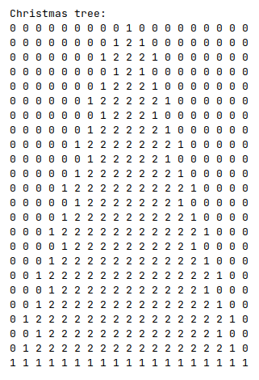

# Embroidery

## Description
A simple application, written in Python, embroidered patterns in nice way on the console. The characters used for
embroidery can be defined. In addition, the task is primarily an exercise of algorithms, which avoids the repetition
of the code.

The application was created as a task at [CodeCool](https://codecool.com/en/) school. A description of the task
can be found here: [Exercise](https://github.com/piotrmludzik/Embroidery/wiki/Exercise).

## Screenshots

## Real-time preview
[https://replit.com/@piotrmludzik/Embroidery](https://replit.com/@piotrmludzik/Embroidery)

## Used technologies:

## Challenges:
- algorithmic thinking,
- present the results in a nice way on the console.

## Contact info
Feel free to contact me in case of any issue, questions or comments.
My contact info can be found on my [GitHub page](https://github.com/piotrmludzik).

## License
The content of the exercise and the initial code in the repository are owned by [CodeCool](https://codecool.com/en/).

Copyright (c) 2020 by Piotr Mludzik. All rights reserved.  
Code in this repository is licensed under MIT license. See [LICENSE](https://github.com/piotrmludzik/Embroidery/blob/master/LICENSE).